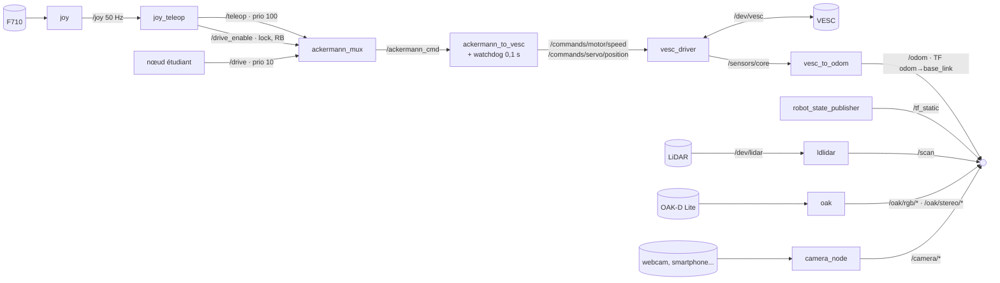
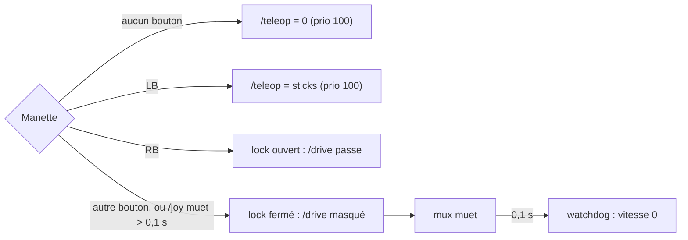
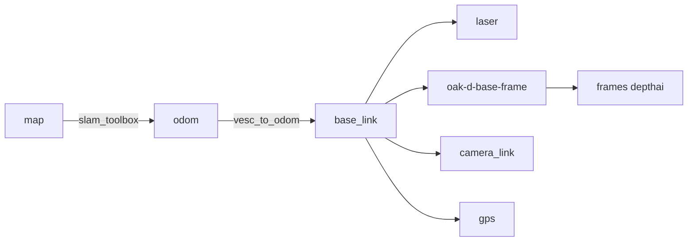

# Robocar ROS 2 : architecture

Jetson Nano (hôte Ubuntu 18.04), ROS 2 Jazzy dans Docker (ubuntu 24.04).\
Une brique = un service `docker compose`.\
Démarrage : `README.md` (étudiants), `BOOTSTRAP.md` (préparer une voiture). Détails et TODO : `docs/ROBOCAR_TO_DO_ROS2.md`. Journal de mise en route : `A_FAIRE_SUR_LA_JETSON.md`.\
État au 2026-09-25 : `control` (VESC, F710) et `lidar` validés sur la voiture, roues en l'air, sécurité comprise. `camera_3d_oak` n'est pas encore testé, et la calibration au sol reste à faire.

## Briques

| Service | Profil | Nœuds | Paquet |
|---|---|---|---|
| `control` | `control` | `joy`, `joy_teleop`, `ackermann_mux`, `ackermann_to_vesc_node`, `vesc_driver_node`, `vesc_to_odom_node`, `robot_state_publisher` | `third_party/` + apt |
| `lidar` | `lidar` | `ldlidar` | `third_party/ldlidar_stl_ros2` |
| `camera_3d_oak` | `camera_3d_oak` | `oak` (driver Luxonis) | apt `depthai_ros_driver` |
| `camera` | `camera` | `camera_node` (générique, vide, à compléter) | `robocar_camera` |
| `gps` | `gps` | *(à faire, phase 7)* | — |
| `gpu` | `gpu` | `gpu_server` hors ROS + `gpu_bridge` *(à faire, phase 8)* | — |

> **Service** : le nom du conteneur dans `docker/compose.yaml`.\
> **Profil** : l'option pour l'activer au lancement. Aucun service ne démarre sans son profil, et rien ne se relance tout seul (`restart: "no"`).\
> *Exemple : `docker compose -f docker/compose.yaml --profile lidar up -d` lance `lidar` seul ; ajouter `--profile control` pour conduire.*

## Graphe des nœuds



## Chaîne de sécurité



| Panne | Arrêt mesuré (PC) | Arrêt mesuré (Jetson) | Voiture, roues en l'air |
|---|---|---|---|
| RB relâché | ~2 ms | 4 ms | 6 ms |
| Autre bouton que RB | vitesse 0 | vitesse 0 | vitesse 0 |
| Manette morte (`joy` ou `joy_teleop`) | ~200 ms | 189 ms | pas testé |
| `/drive` coupé | ~90 ms | 85 ms | 57 ms |
| Mux planté | ~115 ms | 139 ms | — |
| `ackermann_to_vesc` ou `vesc_driver` planté | — | — | timeout du VESC, 500 ms (pas testé) |

## Topics

| Topic | Type | Publié par |
|---|---|---|
| `/drive` | `ackermann_msgs/AckermannDriveStamped` | nœud étudiant (> 10 Hz, RB maintenu) |
| `/teleop` | `ackermann_msgs/AckermannDriveStamped` | `joy_teleop` (LB) |
| `/drive_enable` | `std_msgs/Bool` | `joy_teleop` (RB) |
| `/ackermann_cmd` | `ackermann_msgs/AckermannDriveStamped` | `ackermann_mux` |
| `/odom` | `nav_msgs/Odometry` | `vesc_to_odom_node` |
| `/sensors/core` | `vesc_msgs/VescStateStamped` | `vesc_driver_node` |
| `/scan` | `sensor_msgs/LaserScan` | `ldlidar` |
| `/oak/rgb/*`, `/oak/stereo/*` | `sensor_msgs/Image` | `oak` |
| `/camera/*` | `sensor_msgs/Image` ou `CompressedImage` | `camera_node` |

## Arbre TF



`base_link` = centre de l'essieu arrière (REP-103 / REP-105).

## Dépôt

```
Robocar_ROS2/
├── docker/        Dockerfile, entrypoint.sh, compose.yaml
├── host/          udev, setup_host.sh (Jetson, hors conteneur) ; vesc/ : config VESC Tool
├── ros2_ws/src/
│   ├── third_party/          vesc, ackermann_mux, teleop_tools, ldlidar_stl_ros2 (+ VENDORED.md)
│   ├── robocar_description/  URDF
│   ├── robocar_bringup/      launch/ + config/, un par brique
│   └── robocar_camera/       nœud caméra générique
├── tests/         test_safety_chain.py
├── pc/slam/       guide SLAM (à faire par les étudiants) + config de départ
├── docs/          ROBOCAR_TO_DO_ROS2.md
├── README.md      démarrage étudiants
└── BOOTSTRAP.md   préparer une voiture
```
