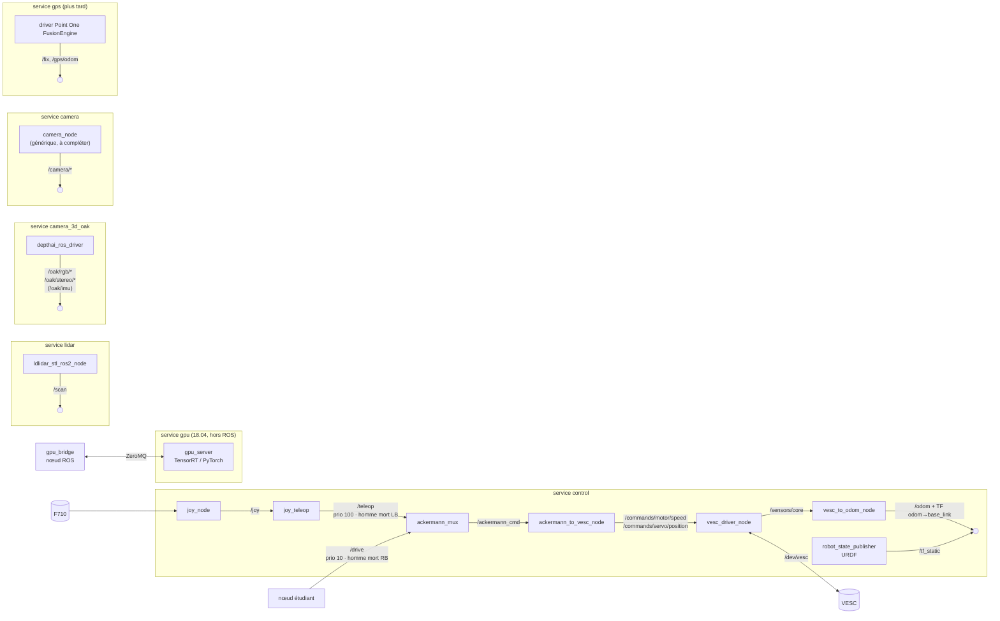

# Robocar : base ROS 2 (TODO)

**Objectif.** Construire des briques de base ROS 2 modulaires et propres : contrôle, LiDAR, caméras, GPS et accès au GPU. Elles restent alignées sur F1TENTH, pour que les étudiants n'aient qu'à écrire leurs nœuds.

Rien n'est repris des anciens projets, à part ce qu'ils ont appris sur le matériel (`ROBOCAR_DESIGN.md`). Tout est développé dans un nouveau dossier, **`Robocar_ROS2/`**, qui deviendra le dépôt git. Les anciens dossiers restent en archive, sans modification.

**Alimentation.** Prise jack 5 V 4 A, cavalier J48. Le micro-USB 2 A ne suffit pas en MAXN : voir `A_FAIRE_SUR_LA_JETSON.md` §0 (batterie 4S : pleine à 16,8 V, arrêt sous 14,0 V).

**Cible et façon de travailler.** Le code tourne sur la **Jetson Nano, dont l'hôte reste en Ubuntu 18.04** (L4T R32.7.1). ROS 2 Jazzy n'est jamais installé sur l'hôte : il tourne dans les conteneurs Docker (§1). On écrit le code sur le PC, dans `Robocar_ROS2/`. On le copie ensuite sur la Jetson (rsync, puis git plus tard), et l'image arm64 est **construite sur la Jetson**. Le contenu de la Jetson a déjà été copié sur le PC (`ROBOCAR_TUTORIAL.md` §3). L'accès SSH marche.

> Les valeurs chiffrées de ce document (fréquences, résolutions, limites, IDs) sont **des valeurs de départ**. Chaque fois, une note indique ce que change un réglage plus haut ou plus bas. Mesurez avant de modifier (voir §6).

---

## 1. Décisions

| Sujet | Choix | Pourquoi |
|---|---|---|
| Distribution | **ROS 2 Jazzy** (Ubuntu 24.04, supportée jusqu'en 2029). Repli sur Humble si le test de la phase 0 échoue | Humble n'est plus supportée après mai 2027. F1TENTH a des branches Jazzy actives |
| Hôte Jetson | On garde L4T R32.7.1 / Ubuntu 18.04 et tout tourne dans Docker | La Nano ne peut pas être mise à jour. Le conteneur partage le kernel de l'hôte : seules les bibliothèques sont en 24.04 |
| Image ROS | `ros:jazzy-ros-base` (arm64 officielle), **pas dusty-nv** | dusty-nv ne supporte plus que JetPack 6/7, et son image R32 n'a pas les paquets apt ROS |
| GPU | Conteneur séparé `l4t-ml` (18.04, CUDA 10.2) relié à ROS par ZeroMQ (§8, phase 8) | CUDA 10.2 n'existe que pour 18.04 / Python 3.6, alors que Jazzy est en Python 3.12 |
| Référence | Stack **F1TENTH** : `vesc`, `ackermann_mux`, `joy_teleop` | Même classe de voiture : Traxxas 1/10, Velineon, VESC, F710 |
| Code tiers | **Snapshot copié** dans `third_party/`, sans `.git` ni submodule, commit d'origine noté | Les mises à jour en amont ne peuvent rien casser, et on peut patcher le code |
| Découpage | 1 image ROS, **1 service `docker compose` par brique**, chacun activé par un profil | On lance seulement les capteurs présents, et le crash d'une brique ne touche pas les autres |
| Conventions | Topics et frames F1TENTH, REP-103/105, pas de namespace | Les configs SLAM, le simulateur et les tutoriels F1TENTH marchent tels quels |

---

## 2. Architecture



- Il n'y a pas de `motor_control_node` maison : ce sont les trois nœuds `vesc` de F1TENTH qui gèrent le moteur.
- Le mux coupe une entrée qui n'a rien reçu depuis 0,2 s.
- Sans bouton d'homme mort maintenu, rien ne passe.
- Le nœud étudiant peut tourner n'importe où (voir §4).

### Chaîne de sécurité (homme mort)

**But** : si n'importe quelle brique plante (manette, `joy`, `joy_teleop`, mux, nœud étudiant), la voiture doit s'arrêter en moins de 0,2 s.

**Le code F1TENTH tel quel ne suffit pas.**
- Le profil `default` de leur `joy_teleop` publie une vitesse nulle sur `/teleop` (priorité 100) tant qu'**aucun** bouton n'est appuyé, ce qui bloque `/drive`. Le bouton `autonomous_control` (RB) ne fait rien d'autre que désactiver ce profil.
- **Défaut 1** : n'importe quel bouton, et pas seulement RB, désactive le zéro et laisse passer `/drive`.
- **Défaut 2** : si la manette se déconnecte, ou si `joy` ou `joy_teleop` plante, plus personne ne publie le zéro. Le mux laisse alors passer `/drive` sans que personne ne tienne RB.
- **Défaut 3** : quand toutes les entrées du mux ont expiré, le mux se tait. `vesc_driver` ne renvoie pas la dernière commande, donc le moteur garde sa dernière consigne jusqu'au timeout du firmware VESC (500 ms, réglé dans VESC Tool, voir `host/vesc/README.md`).

**Ce qu'on met en place** : une config et un seul patch dans le code copié (noté dans `VENDORED.md`).
1. **Lock du mux sur RB, par config uniquement.** `ackermann_mux` gère nativement des *locks*, des topics `std_msgs/Bool` qui ont une priorité et un timeout. Un lock expiré, ou qui n'a encore rien reçu, est considéré comme verrouillé. On ajoute un lock `drive_enable` de priorité 100 avec un timeout de 0,1 s (`mux.yaml`). `joy_teleop` publie `false` (déverrouillé) **à chaque message `/joy`** tant que RB est maintenu. Si RB est relâché, ou si la manette, `joy` ou `joy_teleop` s'arrête, le lock expire, et `/drive` (priorité 10) est masqué. `/teleop` (priorité 100) n'est pas touché.
   - Pas de patch de `joy_teleop` : un profil `message_value` ne publie qu'au moment de l'appui, mais un profil `axis_mappings` avec une entrée `value` publie à chaque message `/joy`. C'est ce qu'utilise `drive_enable` (`joy_teleop.yaml`). `joy` publie à 50 Hz (`autorepeat_rate`), soit 5 messages par timeout.
   - Le profil `default` (zéro sur `/teleop` quand aucun bouton n'est appuyé) reste en place, pour une consigne nulle immédiate en conduite manuelle.
2. **Watchdog dans `ackermann_to_vesc` (patch).** S'il ne reçoit rien sur `ackermann_cmd` pendant 0,1 s (paramètre `cmd_timeout`), il publie une vitesse nulle en continu. Conséquence : `/drive` doit être publié à **plus de 10 Hz**. Ce n'est plus le timeout du VESC qui arrête le moteur.
3. **Dernier filet** : le timeout matériel du firmware VESC (§9), au cas où `vesc_driver` ou `ackermann_to_vesc` lui-même plante.

Les délais ont été mesurés sur le PC le 2026-09-24, puis sur la Jetson le 2026-09-25, avec `tests/test_safety_chain.py`, soit le temps entre la panne et le premier `commands/motor/speed = 0`. La dernière colonne vient des essais sur la voiture, roues en l'air, avec la vraie manette et le VESC (2026-09-25, `A_FAIRE_SUR_LA_JETSON.md` §1 f). Au début, le lock et le watchdog étaient à 0,2 s chacun : leurs délais s'additionnaient, et la manette morte prenait 0,4 s. D'où le passage à 0,1 s.

| Panne | Effet | Mesuré (PC) | Mesuré (Jetson) | Voiture |
|---|---|---|---|---|
| RB relâché | Profil `default` → zéro immédiat sur `/teleop` | ~2 ms | 4 ms | 6 ms |
| Autre bouton que RB | Lock non déverrouillé → `/drive` masqué → watchdog → vitesse 0 | vitesse 0 | vitesse 0 | vitesse 0 |
| Manette débranchée, `joy` ou `joy_teleop` plante | Lock expiré (0,1 s) → `/drive` masqué → watchdog (0,1 s) → vitesse 0 | ~180–200 ms | 189 ms | pas testé |
| Nœud étudiant planté ou coupure réseau | Plus rien sur `ackermann_cmd` → watchdog (0,1 s) → vitesse 0 | ~80–100 ms | 85 ms | 57 ms |
| Mux planté | Watchdog → vitesse 0 | ~115 ms | 139 ms | — |
| `ackermann_to_vesc` ou `vesc_driver` planté | Timeout du firmware VESC | — | — | réglé à 500 ms, pas testé |

### Arbre TF (REP-105)

```
map ──(slam_toolbox)──> odom ──(vesc_to_odom)──> base_link   (centre essieu arrière)
                                                  ├── laser             (URDF)
                                                  ├── oak-d-base-frame  (URDF → frames depthai)
                                                  ├── camera_link       (URDF)
                                                  └── gps               (URDF)
```

---

## 3. Arborescence cible

```
Robocar_ROS2/
├── README.md                   # démarrage rapide étudiants
├── .env.example                # ROS_DOMAIN_ID, clé Polaris... (.env non versionné)
├── docs/
│   └── ROBOCAR_TO_DO_ROS2.md   # ce fichier
├── docker/
│   ├── Dockerfile              # ros:jazzy-ros-base + dépendances apt + colcon build
│   ├── entrypoint.sh           # source le workspace ; refuse ROS_DOMAIN_ID vide ou 0
│   ├── Dockerfile.gpu          # l4t-ml r32.7.1 + pyzmq (serveur GPU)
│   └── compose.yaml            # 1 service par brique, profils
├── host/                       # à installer sur la Jetson, hors conteneur
│   ├── 99-robocar.rules        # udev : /dev/vesc, /dev/lidar, OAK (F710 : voir phase 0)
│   └── setup_host.sh           # docker, groupes, chrony, swap, nvpmodel
├── ros2_ws/src/
│   ├── third_party/            # copie simple du code (pas de lien git) ; toute modification est notée dans VENDORED.md
│   │   ├── VENDORED.md         # origine, branche, commit, patchs
│   │   ├── vesc/               # f1tenth/vesc @ jazzy (patch : watchdog ackermann_to_vesc)
│   │   ├── ackermann_mux/      # f1tenth/ackermann_mux
│   │   ├── teleop_tools/       # f1tenth/teleop_tools (joy_teleop)
│   │   └── ldlidar_stl_ros2/   # ldrobotSensorTeam @ master
│   ├── robocar_description/    # URDF/xacro : dimensions, positions capteurs
│   ├── robocar_bringup/        # launch/*.launch.py + config/*.yaml par brique
│   ├── robocar_camera/         # nœud caméra générique, vide : n'importe quelle caméra (webcam, smartphone...)
│   ├── robocar_gpu_bridge/     # nœud Python : topic ROS ⇄ ZeroMQ ⇄ gpu_server
│   └── robocar_examples/       # nœud exemple publiant /drive (sim + voiture)
├── tests/
│   └── test_safety_chain.py    # test de la chaîne de sécurité sans manette ni VESC (§2)
├── gpu/
│   └── gpu_server.py           # serveur ZeroMQ, charge un .engine TensorRT ou un modèle torch
└── pc/
    ├── slam/                   # guide SLAM pour les étudiants (README.md) + config de départ ; le SLAM est à faire par eux
    └── sim/                    # instructions f1tenth_gym_ros @ dev-jazzy
```

On installe par apt tout ce qui existe en paquet : `joy`, `ackermann_msgs`, `depthai_ros_driver`, `image_transport_plugins` (et `slam_toolbox` côté PC, installé par les étudiants). On ne copie dans `third_party/` que ce qui n'est pas disponible en apt, ou ce dont la version F1TENTH diffère. Par exemple, `ros-jazzy-joy-teleop` existe en apt, mais sans la modification F1TENTH (profil `default`) : on prend donc la version F1TENTH. `ros-jazzy-vesc` et `ros-jazzy-ackermann-mux` n'existent pas en apt. Les dépendances de `vesc` (`serial_driver`, `io_context`) existent, elles, en apt.

---

## 4. Où faire tourner quoi (conseils, pas des règles)

Avec ROS 2, un nœud tourne indifféremment sur la Jetson ou sur le PC. C'est un choix à faire selon le besoin.

| Brique | Conseil | Implications |
|---|---|---|
| Drivers (VESC, LiDAR, caméras, GPS) | Jetson, forcément | Ils sont branchés dessus |
| Nœud de contrôle (publie `/drive`) | Plutôt Jetson | Sur le PC, une coupure réseau prive la voiture de commande. Le mux coupe au bout de 0,2 s : c'est sûr, mais la voiture s'arrête. La latence réseau s'ajoute aussi à la boucle |
| Perception (traitement d'image, détection) | Au choix | Sur la Nano : CPU limité (4 cœurs A57), mais aucun transfert. Sur le PC : puissance disponible, mais les images doivent passer par le réseau (voir §6) |
| SLAM, planification | Au choix | Sur la Nano : lourd, à mesurer avec `tegrastats`. Sur le PC : dépend de la stabilité du réseau (`/scan` est léger, une carte 2D passe bien) |
| Inférence GPU | Jetson (service `gpu`) | Voir phase 8 |
| Visualisation (RViz2, Foxglove) | PC | Il n'y a pas d'écran sur la voiture, et RViz est trop lourd pour la Nano |

---

## 5. Services `docker compose`

| Service | Profil | Lance | Périphériques |
|---|---|---|---|
| `control` | `control` | `joy`, `joy_teleop`, `ackermann_mux`, 3 nœuds `vesc`, `robot_state_publisher` | `/dev/vesc`, `/dev/input` |
| `lidar` | `lidar` | `ldlidar_stl_ros2_node` | `/dev/lidar` |
| `camera_3d_oak` | `camera_3d_oak` | `depthai_ros_driver` | `/dev/bus/usb` (privileged) |
| `camera` | `camera` | `camera_node` (générique, `robocar_camera`) | selon la caméra (`/dev/video*` à décommenter, ou réseau) |
| `gps` | `gps` | *(à définir avec Point One)* | `/dev/gps` |
| `gpu` | `gpu` | `gpu_server.py` (image `Dockerfile.gpu`, `runtime: nvidia`) | GPU |

- **Réglages communs** : `network_mode: host` et `ipc: host` (DDS en mémoire partagée entre conteneurs), `restart: "no"` (démarrage automatique plus tard, §9), variables lues dans `.env`. Tous les services ROS partagent la même image, seule la `command` change.
- **Lancement** : aucun service ne démarre sans son profil. Par exemple `docker compose --profile control --profile lidar up -d`, ou `--profile lidar` seul pour tester le LiDAR sans le contrôle.
- **Rebranchement USB** : un périphérique passé par `devices:` est perdu s'il est débranché puis rebranché, et il faut alors relancer le service. L'alternative est de monter `/dev` en entier avec `privileged` : plus simple, mais moins isolé.

---

## 6. Réseau distribué, fréquences et mesure

### `ROS_DOMAIN_ID`, à changer obligatoirement
- Tous les appareils d'un même réseau qui ont le même ID se voient entre eux. Deux équipes avec le même ID pourraient donc **commander la voiture de l'autre**.
- **Règle** : ID = numéro du département sur deux chiffres (ex. Hauts-de-Seine → 92). S'il y a plusieurs équipes dans le même département, elles s'arrangent en faisant ±1.
- Corse (2A/2B) → 20. Outre-mer (971 à 976), trop grand : prendre entre 96 et 101.
- La plage valide est 1 à 101 : au-delà, il y a des conflits de ports sous Linux. **Ne jamais utiliser 0**, qui est la valeur par défaut de tout le monde.
- La valeur est à mettre dans `.env` (copié depuis `.env.example`). Elle doit être identique sur la Jetson, le PC et tous les conteneurs.

### Découverte et horloge
- `ROS_AUTOMATIC_DISCOVERY_RANGE=SUBNET`.
- **chrony** : la Jetson se synchronise sur le PC. La Nano n'a pas de pile pour son horloge : sans réseau, elle démarre à une date fausse, et les TF sont rejetées.
- Commencer avec le DDS par défaut (Fast DDS) sur Ethernet. En Wi-Fi, si la découverte ou le débit posent problème, passer à `rmw_zenoh_cpp`, avec un routeur sur le PC.

### Fréquences et résolutions de départ

| Flux | Départ | Plus haut | Plus bas |
|---|---|---|---|
| Commande `/drive` | 20–50 Hz | Réactivité meilleure, peu de coût | En dessous de 10 Hz, le watchdog envoie des zéros entre deux commandes (0,1 s, §2) : la voiture avance par à-coups |
| `/scan` | ~10 Hz (fixé par le LiDAR) | — | — |
| OAK RGB | 640×360, 15 fps | Plus de CPU (encodage), plus de bande passante, risque de saturer le Wi-Fi | Plus de latence, perception plus lente à haute vitesse |
| OAK profondeur | 480P (capteurs mono OV7251 de la Lite, 640×480), 15 fps | Idem | Idem |
| Caméra générique (webcam) | 640×480, 15 fps, MJPEG | Idem | Idem |
| Caméra générique (smartphone) | 1–2 Hz | Limité par l'application et le Wi-Fi | — |

- Hors de la Jetson, les images passent **en `compressed`** (`image_transport`). En raw, un flux 640×360 à 15 fps fait environ 10 Mo/s.
- **Mesurer avant de changer** :
  - `ros2 topic hz <topic>` : fréquence réelle ;
  - `ros2 topic bw <topic>` : bande passante ;
  - `tegrastats` : CPU, GPU, RAM et température de la Nano.

---

## 7. Calibration (valeurs de départ)

| Paramètre | Départ | Méthode |
|---|---|---|
| `speed_to_erpm_gain` | 4614 (valeur F1TENTH, Traxxas + Velineon). Notre voiture est différente : Fiesta **BL-2s**, 4 pôles, pignon 13 / couronne 36, roues de ~83 mm (`host/vesc/README.md`). **À calibrer** | Formule : `pôles/2 × rapport de réduction × 60 / (π × Ø roue)`. Vérification : commander 1 m/s sur 5 m mesurés, puis gain × v_cmd / v_mesurée |
| `steering_angle_to_servo_offset` | 0,50 | Ajuster jusqu'à ce que la voiture roule droit avec un angle de 0 |
| `steering_angle_to_servo_gain` | **−0,88** (≈ 0,3 / 0,34 rad) | Signe vérifié le 2026-09-25 : un angle positif tourne **à gauche** (REP-103) |
| `servo_min` / `servo_max` | 0,20 / 0,80 | Vérifié le 2026-09-25 : le servo ne force pas en butée |
| `speed_min` / `speed_max` (ERPM) | ±5000 (~1 m/s) | Augmenter progressivement. Plus vite, les collisions sont plus violentes et l'odométrie glisse davantage |
| `joy_teleop` `drive-speed` scale | 1,0 m/s | F1TENTH met 5, ce qui est trop pour débuter |
| `joy_teleop` `drive-steering_angle` scale | 0,34 rad | Braquage maximal mesuré |
| `wheelbase` (`vesc_to_odom`) | 0,26 m | À remesurer |
| Positions des capteurs (URDF) | à mesurer | Par rapport au centre de l'essieu arrière, x vers l'avant, z vers le haut |

La F710 doit être en mode **X** (interrupteur au dos). Vérifier la numérotation des boutons avec `ros2 topic echo /joy`.

- Les numéros ne sont pas ceux de la config F1TENTH (`deadman_buttons: [6]`, `[8]`). On supposait la numérotation SDL2 (LB = 9, RB = 10), mais la mesure du 2026-09-25 donne la numérotation `xpad` (11 boutons, 8 axes) :
  - LB = **4**, RB = **5**, A = 0 ;
  - stick gauche vertical = axe **1** (haut = +), stick droit horizontal = axe **3** (gauche = +) ;
  - axes 2 et 5 = gâchettes LT et RT, qui valent **1,0 au repos** : ne jamais y mettre la direction.
- **LED MODE éteinte** : allumée, elle échange le stick gauche et la croix (axes 6 et 7).
- `device_id: 0` suffit. `device_name` attend le nom SDL de la manette, pas un chemin `/dev`.

---

## 8. TODO

### Phase 0 : préparer la Jetson et valider Jazzy

Les tests de cette phase, comme tous les tests sur le matériel, se font sur place, Jetson branchée. Tout ce qui peut se tester sans matériel l'est d'abord sur le PC (phase 1).

- [x] **Sauvegarder la carte SD** (image `dd` complète). **Fait le 2026-09-25, mais après** la préparation de l'hôte et le build : `backups/jetson_sd_2026-09-25.img` (64 Go), hors du dépôt. L'image contient donc un système prêt, qui peut aussi servir à cloner la carte. À l'origine, il fallait la faire avant toute modification de l'hôte. Le code est déjà copié sur le PC : cette sauvegarde protège le **système** de la Jetson. On va toucher à udev, au swap, aux groupes et peut-être à Docker. Si une mise à jour de Docker casse `nvidia-container-runtime`, l'image permet de tout restaurer.
- [x] Accès SSH et IP de la Jetson (voir `ROBOCAR_TUTORIAL.md` §2). L'IP est donnée par le DHCP du PC et peut changer : si `ssh` ne répond pas, vérifier avec `ip neigh` ou `nmap -sn 10.42.0.0/24`.
- [x] `docker version` : noter la version. Les vieux Docker de JetPack 4.6 peuvent faire échouer les conteneurs 22.04/24.04 (appel `clone3` bloqué par seccomp). **Docker 20.10.7** (client et serveur).
- [x] `docker run --rm -it --network host ros:jazzy-ros-base ros2 topic pub -r 2 /chatter std_msgs/msg/String "{data: hello}"`. `ros-base` ne contient pas `demo_nodes_cpp` : on publie avec `ros2 topic pub`. En cas d'échec, essayer `--security-opt seccomp=unconfined`, puis mettre Docker à jour **en conservant `nvidia-container-runtime`**. **OK sans seccomp (2026-09-25)**, aucune erreur `clone3`.
- [ ] ~~Même test avec `ros:humble-ros-base`, qui sert de repli.~~ Non fait, inutile puisque Jazzy marche.
- [x] Faire parler un talker sur la Jetson avec un listener sur le PC (même `ROS_DOMAIN_ID`). **OK** : le PC (Jazzy natif) reçoit `/chatter`, domaine 42.
- [x] Plugin `docker compose` : absent de JetPack 4.6. **v5.5.1** installé dans `~/.docker/cli-plugins/`, compatible avec le démon 20.10.
- [x] Préparer l'hôte (`host/setup_host.sh`, lancé le 2026-09-25) :
  - [x] utilisateur dans les groupes `docker`, `dialout` et `input` (c'était déjà le cas) ;
  - [x] swap de 4 Go (`/swapfile`, en plus du zram d'origine : 5,9 Go au total) ;
  - [x] `nvpmodel -m 0` (MAXN) ;
  - [x] chrony : `^*` sur le PC ;
  - [x] vérifier l'espace disque (`df -h`, `docker system df`) : 59 Go, dont **41 Go libres** avant le script, et 36 Go après (swap et image `ros:jazzy-ros-base` compris).
- [ ] Règles udev dans `host/99-robocar.rules` (installées par `setup_host.sh`, à vérifier avec le matériel branché) :

  | Périphérique | ID USB |
  |---|---|
  | VESC | `0483:5740` |
  | LiDAR CP2102 ou CH340 | `10c4:ea60` / `1a86:7523` |
  | F710 | `046d:c21f` |
  | OAK | `03e7` |

  Vérifier avec `ls -l /dev/vesc /dev/lidar`. Contrôler les IDs réels avec `lsusb`.
  - F710 : `joy` (SDL2) la trouve par `device_id`, pas par un chemin. Un lien `/dev/input/joypad-f710` ne lui servirait donc à rien : il suffit de passer `/dev/input` au conteneur (groupe `input`). La règle `046d:c21f` ne sert qu'à vérifier avec `lsusb` que la manette est bien en mode X.
  - OAK : règle `SUBSYSTEM=="usb", ATTRS{idVendor}=="03e7", MODE="0666"` (doc Luxonis).
- [x] **Décision Jazzy ou Humble** : **Jazzy** (2026-09-25). Le conteneur tourne sur l'hôte 18.04 sans option seccomp, et la communication DDS avec le PC fonctionne.

### Phase 1 : squelette `Robocar_ROS2/`
- [x] Créer l'arborescence du §3 et y déplacer ce fichier dans `docs/`.
- [x] Copier les snapshots dans `third_party/` : on copie seulement les fichiers, **sans `.git` ni submodule**. Le code ne garde aucun lien git avec l'amont. Remplir `VENDORED.md` avec l'URL, la branche, le hash de commit et la date de copie. Versions retenues (vérifiées le 2026-09-24 avec `git ls-remote`) :

  | Dépôt | Branche | Commit | Remarque |
  |---|---|---|---|
  | `f1tenth/vesc` | `jazzy` | `1bc8251` | Identique à `humble`. C'est le commit référencé par `f1tenth_system@jazzy-devel` |
  | `f1tenth/ackermann_mux` | `foxy-devel` | `b3c0b08` | Pas de branche jazzy. Commit référencé par `f1tenth_system@jazzy-devel` |
  | `f1tenth/teleop_tools` | `humble-devel` | `163827a` | Pas de branche jazzy. Commit référencé par `f1tenth_system@jazzy-devel`. **Ne pas utiliser `ros-jazzy-joy-teleop` (apt)** : la version F1TENTH modifie le paquet d'origine (`ros-teleop/teleop_tools`) en ajoutant le profil `default`, actif quand aucun bouton n'est appuyé (voir §2, chaîne de sécurité) |
  | `ldrobotSensorTeam/ldlidar_stl_ros2` | `master` | `bf668a8` | — |
  | `f1tenth/f1tenth_system` | `jazzy-devel` | `cffbbd7` | Configs seulement, pas copié dans `third_party/` |
  | `f1tenth/f1tenth_gym_ros` | `dev-jazzy` | `2c01981` | PC seulement (phase 6) |

  Méthode pour chaque dépôt : `git clone <url> /tmp/x && git -C /tmp/x checkout <commit>`, puis copier le contenu sans `.git` (`rsync -a --exclude .git /tmp/x/ third_party/<nom>/`).

  **État de `F1Tenth/` (2026-09-24, dossier supprimé depuis) :**
  - `vesc/` est sur la branche `ros2` (`153998d`, 2023), et non `jazzy` ;
  - `f1tenth_gym_ros/` est sur `main` (`883394d`), et non `dev-jazzy` ;
  - dans `f1tenth_system/`, les dossiers `vesc/`, `ackermann_mux/` et `teleop_tools/` sont vides (submodules non initialisés) ;
  - seuls `f1tenth_system` (`cffbbd7`) et `ldlidar_stl_ros2` (`bf668a8`) sont aux bonnes versions.
- [x] Reprendre les configs de `f1tenth_system/f1tenth_stack/config/` (`vesc.yaml`, `mux.yaml`, `joy_teleop.yaml`, `f1tenth_online_async.yaml`) comme point de départ de `robocar_bringup/config/`.
- [x] Créer `robocar_description` : xacro minimal avec `base_link`, `laser`, `oak-d-base-frame`, `camera_link`, `gps`, et des positions provisoires.
- [x] Créer `robocar_bringup` : un launch par brique (`control`, `lidar`, `camera_3d_oak`, `camera`), chacun avec son YAML.
- [x] Écrire `docker/Dockerfile` : `rosdep install`, puis `colcon build --parallel-workers 1` (4 Go de RAM), et un entrypoint qui source le workspace.
- [x] Écrire `docker/compose.yaml` (§5) et `.env.example` (`ROS_DOMAIN_ID`, `ROS_AUTOMATIC_DISCOVERY_RANGE`).
- [x] **Tests sur le PC, sans matériel** :
  - construire l'image en x86, puis vérifier que `colcon build` passe et que chaque launch démarre (les drivers échouent faute de périphérique, mais sans erreur de paramètre ni de dépendance) ;
  - chaîne de sécurité (§2) testée sans VESC : lancer `joy_teleop`, le mux et `ackermann_to_vesc` ; simuler `/joy` et `/drive` avec `ros2 topic pub`, puis vérifier `/commands/motor/speed` dans chaque cas du tableau ;
  - optionnel : build arm64 via `docker buildx` + QEMU, pour trouver les erreurs propres à l'ARM avant d'aller sur la Jetson (lent). **Pas fait.**

  **Résultats sur le PC (2026-09-24, x86)** :
  - build de l'image OK. Il a fallu deux corrections : `ros-jazzy-asio-cmake-module` en apt (dépendance non déclarée de `io_context`), et `#include <pthread.h>` dans `ldlidar_stl_ros2` (voir `VENDORED.md`) ;
  - image de **3,5 Go** en x86, dont la majeure partie vient de `depthai_ros_driver` et d'OpenCV. À surveiller sur la SD de 64 Go. Si c'est trop, prévoir une image séparée pour l'OAK ;
  - chaîne de sécurité : `tests/test_safety_chain.py --kill-mux` donne 10/10 (délais au §2). Pour le lancer, dans le conteneur : `ros2 launch robocar_bringup control.launch.py with_joy:=false with_vesc:=false`, puis `python3 tests/test_safety_chain.py`. Le dossier `tests/` n'est pas copié dans l'image : le monter avec `-v` ;
  - launches `lidar`, `camera` et `camera_3d_oak` : démarrent et échouent proprement faute de périphérique ;
  - autres éléments faits en avance :
    - `host/99-robocar.rules` et `host/setup_host.sh` (phase 0, non exécutés) ;
    - `pc/slam/f1tenth_online_async.yaml`, avec `base_frame` corrigé de `laser` en `base_link` ;
    - `entrypoint.sh`, qui refuse de démarrer si `ROS_DOMAIN_ID` est vide ou vaut 0 ;
  - piège rencontré : le launch depthai interprète les substitutions `$(...)` dans le YAML de paramètres, **même dans les commentaires**.
- [x] Construire l'image sur la Jetson et noter le temps de build et la taille de l'image. **2026-09-25** : OK du premier coup en arm64, 17 min au total (dont 6 min de `colcon`), image de **2,2 Go**, 35 Go restent libres. Uniquement des avertissements sans gravité (voir `A_FAIRE_SUR_LA_JETSON.md`, « Déjà fait » E).
- [x] Supprimer `F1Tenth/` une fois les snapshots en place (fait le 2026-09-25 ; aucun fichier n'y avait été modifié en local, tout est récupérable sur GitHub aux commits du tableau ci-dessus).

### Phase 2 : contrôle (roues en l'air)
- [x] Écrire `config/vesc.yaml` avec les valeurs du §7 et `port: /dev/vesc` (fait en phase 1).
- [x] Configurer le VESC dans VESC Tool (2026-09-25) : l'EEPROM n'était pas corrompue, détection FOC, limites, timeout, sortie servo. Voir `host/vesc/README.md`.
- [x] `vesc_driver` seul : `/sensors/core` publie la tension (15,7 V), l'ERPM et les fautes (0). `temp_fet` et `temp_motor` restent à 0,0 : à regarder.
- [x] Ajouter `joy` et `joy_teleop` : avec LB maintenu, les roues et la direction répondent. LB relâché, tout s'arrête. Numéros relevés (§7) et `joy_teleop.yaml` corrigé.
- [x] Chaîne de sécurité (§2), faite en phase 1 et testée sur le PC :
  - profil RB → `std_msgs/Bool` `false` sur `drive_enable` (`joy_teleop.yaml`) ;
  - lock `drive_enable` dans `mux.yaml` (priorité 100, timeout 0,2 s) ;
  - watchdog `cmd_timeout` dans `ackermann_to_vesc` (patch, voir `VENDORED.md`).
- [x] Ajouter `ackermann_mux`, **sans remapping** (vérifié : les commandes arrivent bien au moteur par `ackermann_cmd`) : il publie directement `ackermann_cmd` (`ackermann_mux.cpp:91`), et c'est ce topic qu'écoute `ackermann_to_vesc`. Le remapping `ackermann_cmd_out → ackermann_drive` du launch F1TENTH vise un topic qui n'existe pas, donc il ne fait rien. Contrôler avec `ros2 node info` ou `rqt_graph`.
- [x] Publier `/drive` à la main avec RB maintenu, puis vérifier que la manette garde la priorité (2026-09-25).
- [ ] Tester chaque ligne du tableau de la chaîne de sécurité (§2), roues en l'air, avec `/drive` publié et RB maintenu :
  - relâcher RB ;
  - appuyer sur un autre bouton que RB (`/drive` doit rester bloqué) ;
  - débrancher le dongle de la F710 ;
  - tuer `joy` ;
  - couper la publication `/drive` ;
  - tuer le mux.

  Dans chaque cas, les roues doivent s'arrêter en moins de 0,2 s.

  **Fait le 2026-09-25** : RB relâché, autre bouton et `/drive` coupé sont OK (délais au §2). **Restent** le débranchement du dongle, `joy` tué, le mux tué, et `docker compose restart control` (timeout du VESC).
- [ ] Calibrer la direction, puis la vitesse au sol (§7).
- [ ] `/odom` : rouler 2 m en ligne droite et comparer avec la distance réelle. Noter le comportement à basse vitesse, le moteur n'ayant pas de capteur.

### Phase 3 : LiDAR
- [ ] Vérifier la référence sur l'étiquette : STL-19P à 230400 bauds, ou STL-27L à 921600.
- [x] **LiDAR reconnu et publié (2026-09-25)** : CP2102 `10c4:ea60`, `/dev/lidar → ttyUSB0` par udev. `/scan` à 9,99 Hz sur la Jetson et 9,8 Hz sur le PC (41 Ko/s). Les données arrivent à 230400 bauds avec `LDLiDAR_LD19`, donc c'est un STL-19P / LD19 (étiquette à confirmer).
- [x] Écrire `config/lidar.yaml` (fait en phase 1) :
  - `product_name: LDLiDAR_LD19` ;
  - `port_name: /dev/lidar` ;
  - `frame_id: laser` (et non `base_laser` comme dans leur launch) ;
  - `laser_scan_dir: true` (sens antihoraire, REP-103).
- [x] `/scan` visible dans RViz2 sur le PC (Fixed Frame `laser`, sans `control`), le 2026-09-25.
- [x] Dans RViz2 sur le PC, avec la Fixed Frame `base_link` : l'avant du scan correspond à l'avant de la voiture, et la gauche à la gauche (2026-09-25).
- [x] Masquer le châssis s'il apparaît dans le scan : **pas nécessaire**, il n'apparaît pas.
- [ ] Mesurer la position réelle du LiDAR (URDF provisoire : x = 0,25 m, z = 0,15 m).

### Phase 4 : OAK-D Lite
- [x] Installer `ros-jazzy-depthai-ros-driver` dans l'image (fait en phase 1, version 2.12.2). On prend la version v2, pas `-v3`, qui existe aussi en apt : la v2 est celle qu'utilisent la doc et les exemples actuels pour l'OAK-D Lite. On passera à la v3 seulement en cas de besoin.
- [ ] Appliquer la règle udev `03e7` sur l'hôte.
- [ ] Configuration de départ (§6), écrite dans `config/camera_3d_oak.yaml` et `launch/camera_3d_oak.launch.py` :
  - RGB en 640×360 (1080P avec `i_isp_num: 1` et `i_isp_den: 3`) ;
  - profondeur en 480P (capteurs mono OV7251 de la Lite, et non 400P) ;
  - 15 fps ;
  - `camera_model: OAK-D-LITE`, frames depthai accrochées sous `oak-d-base-frame` (URDF), lui-même sous `base_link` ;
  - `rectify_rgb: false`, pour économiser le CPU de la Nano.

  **À vérifier avec la caméra branchée** : les noms `i_isp_num`, `i_isp_den` et `i_resolution` sont repris de la doc 2.x, mais n'ont pas pu être validés sans appareil. Contrôler la taille réelle avec `ros2 topic echo /oak/rgb/camera_info --once`.
- [ ] Vérifier si notre révision a une IMU (BMI270). Si oui, publier `/oak/imu/data`.
- [ ] Mesurer `tegrastats`, ainsi que `ros2 topic bw` sur le flux `compressed` vu depuis le PC.

### Phase 5 : caméra générique
- [x] Paquet `robocar_camera` : un nœud `camera_node` vide (squelette), et non un driver par type de caméra. Les étudiants y branchent n'importe quelle caméra (webcam USB, smartphone, etc.) et écrivent le code de capture.
  - Topics attendus : `/camera/image_raw` (`sensor_msgs/Image`) ou `/camera/image/compressed` (`CompressedImage`), frame `camera_link`.
  - Webcam USB : décommenter `devices: /dev/video0` dans `compose.yaml`.

### Phase 6 : PC, SLAM et simulateur
- [x] Installer Jazzy sur le PC, en natif, avec RViz2. Fait : il a servi aux tests du LiDAR le 2026-09-25.
- **SLAM : c'est aux étudiants de le faire, il n'est pas fourni.** L'image ne contient ni `slam_toolbox` ni Nav2. On leur donne seulement :
  - [x] le guide `pc/slam/README.md` : prérequis, installation, lancement, RViz, sauvegarde de la carte, bag, pièges connus ;
  - [x] une config de départ, `pc/slam/f1tenth_online_async.yaml` ;
  - [ ] optionnel : vérifier nous-mêmes que le guide marche de bout en bout, une fois `control` validé avec le VESC. Sans `/odom`, pas de SLAM.
- [ ] Installer `f1tenth_gym_ros` (branche `dev-jazzy`) : c'est la même interface (`/scan`, `/odom`, `/drive`) pour développer sans la voiture.
- [ ] Écrire `robocar_examples` : un nœud Python minimal qui publie `/drive` (par exemple un suivi de mur) et qui marche tel quel dans le simulateur et sur la voiture.

### Phase 7 : GPS RTK (plus tard, avec Point One)
- [ ] Voir avec Point One s'il existe un driver ROS 2 FusionEngine, et comment passent les corrections Polaris.
- [ ] Cible :
  - topics `/fix` (`NavSatFix`) et `/gps/odom` ;
  - frame `gps` ;
  - service `gps`.
- [ ] Clé Polaris dans `.env`, jamais dans le dépôt.

### Phase 8 : brique GPU (fournie, utilisation optionnelle)

Les nœuds ROS (Jazzy, Python 3.12) ne peuvent pas charger CUDA 10.2. Le GPU passe donc par un conteneur séparé, et un nœud ROS sert de pont :

```
[nœud ROS gpu_bridge] ──ZeroMQ (tcp://localhost)──> [gpu_server.py]
  topic → numpy                                       conteneur l4t-ml r32.7.1, runtime nvidia
  numpy → topic résultat  <──────────────────────     TensorRT 8.2 / PyTorch 1.10, Python 3.6
```

- [ ] Vérifier le tag de l'image : `nvcr.io/nvidia/l4t-ml:r32.7.1-py3` (NGC, qui contient PyTorch, TensorRT et ONNX). Tester :
  ```bash
  docker run --rm --runtime nvidia nvcr.io/nvidia/l4t-ml:r32.7.1-py3 python3 -c "import torch; print(torch.cuda.is_available())"
  ```
- [ ] Écrire `docker/Dockerfile.gpu` : l4t-ml + `pyzmq` + `msgpack`.
- [ ] Écrire `gpu/gpu_server.py` : socket REP ZeroMQ qui reçoit un tableau numpy sérialisé, exécute le modèle et renvoie la sortie. Il charge un `.engine` TensorRT, ou un modèle torch pour prototyper.
- [ ] Écrire `robocar_gpu_bridge` : il s'abonne à un topic (image ou tableau), envoie le contenu au serveur et publie le résultat. Paramètres : `input_topic`, `output_topic`, `endpoint`, `timeout`.
- [ ] Documenter la procédure pour les étudiants :
  1. entraîner sur PC ;
  2. exporter en ONNX (opset ≤ 13 pour TensorRT 8.2) ;
  3. convertir sur la Jetson, dans le conteneur `gpu` : `trtexec --onnx=m.onnx --saveEngine=m.engine --fp16` ;
  4. servir le moteur.
- [ ] Fournir un exemple complet de bout en bout (par exemple un petit classifieur sur `/oak/rgb`). Mesurer la latence aller-retour et la RAM : les 4 Go sont partagés entre CPU et GPU.
- [ ] Limites à écrire dans la doc :
  - GPU Maxwell, FP16 mais pas d'INT8 ;
  - pas de modèles récents lourds ;
  - le conteneur `gpu` consomme environ 1 Go de RAM au repos.

### Phase 9 : documentation étudiants
- [x] `README.md` de démarrage rapide (2026-09-25), et `BOOTSTRAP.md` pour préparer une voiture. Plan de départ :
  1. choisir son `ROS_DOMAIN_ID` ;
  2. copier `.env` ;
  3. `docker compose --profile ... up` ;
  4. vérifier `/scan` et `/odom` dans RViz ;
  5. lancer l'exemple `/drive`.
- [x] Tableau des topics et frames disponibles, avec la brique qui les publie (dans `ARCHITECTURE.md`).
- [x] Section « où faire tourner quoi » (§4) et mesure (§6), dans `README.md` §5.
- [x] Section « préparer son PC » : chrony, `ufw`, Jazzy, `ROS_DOMAIN_ID`, et pourquoi chaque étape (`README.md` §2).
- [ ] `robocar_examples` : remplacer l'exemple minimal du README par un vrai nœud (phase 6).
- [x] Section de sécurité (`README.md` §4) :
  - roues en l'air pour les premiers essais ;
  - homme mort ;
  - LiPo : surveiller la tension dans `/sensors/core`, ne jamais descendre sous 3,5 V par cellule.

---

## 9. Plus tard

- [x] **VESC Tool** (fait le 2026-09-25, `host/vesc/README.md`) :
  - pas besoin de reflasher : Fw 7.00, et l'EEPROM garde bien la config. C'était `vesc_autoconfig.sh` qui l'écrasait, et `vesc-config.service` est maintenant désactivé ;
  - détection FOC du BL-2s ;
  - limites de courant (30 A moteur, 20 A batterie), coupure batterie (14,0 / 13,2 V), Max ERPM 30000, timeout 500 ms, sortie servo activée.

  Si le mode RPM reste saccadé à basse vitesse, passer au pilotage en courant. Roues en l'air, il est régulier de ~2300 à ~4600 ERPM.
- [ ] Tester le timeout du VESC : `docker compose restart control` pendant que les roues tournent.
- [ ] **Wi-Fi** : vérifier que le chipset du dongle a un driver pour le kernel 4.9, puis refaire les tests du §6. Passer à Zenoh si besoin.
- [ ] **Surveillance batterie** : un nœud qui lit `/sensors/core` et coupe `/drive` sous un seuil de tension.
- [ ] **Démarrage automatique** : service systemd qui lance `docker compose up`.
- [ ] **Git et CI** : build arm64 dans GitHub Actions, images publiées sur GHCR ; les étudiants n'ont plus qu'à faire `docker compose pull`.
- [ ] **Nav2**, une fois le SLAM stable.
- [ ] **VPU de l'OAK-D Lite** : exécuter un réseau directement dans la caméra (voir §10).

---

## 10. Pistes IA embarquée

| Piste | Principe | Limite |
|---|---|---|
| CPU | `onnxruntime` CPU dans le conteneur Jazzy | Suffit jusqu'à quelques centaines de milliers de paramètres |
| GPU de la Nano | Phase 8 (conteneur `gpu` + ZeroMQ) | CUDA 10.2, Maxwell, RAM partagée |
| VPU de l'OAK-D Lite | Myriad X (~1,4 TOPS pour les réseaux). Chaîne : PyTorch → ONNX → `.blob` (outils Luxonis), exécuté dans la caméra via `depthai_ros_driver` | FP16, jeu d'opérations restreint, modèles légers (YOLO nano, petit U-Net). Rien ne passe par la Jetson |
| Petit LLM | `llama.cpp`, modèle d'environ 1B paramètres quantifié | Quelques tokens par seconde : démo seulement |

---

## 11. Fichiers à lire pour réaliser ces tâches

| Fichier | À lire pour | Sections utiles |
|---|---|---|
| `ROBOCAR_DESIGN.md` | Le matériel réel : VESC, moteur, LiDAR, OAK, F710, ports, protocole VESC, historique du réglage moteur | §1, §3, §5 (le reste décrit l'ancien code, à ne pas reprendre) |
| `ROBOCAR_TUTORIAL.md` | Accès à la Jetson (SSH, mot de passe, IP), règles udev, commandes utiles | §1, §2, §6.1, §6.2, §8. **Attention** : ses §4, §5 et §7 (Humble, dustynv) sont remplacés par ce fichier |
| `F1Tenth/` | **Supprimé.** Les références se trouvent sur GitHub aux commits de la phase 1. `f1tenth_gym_ros` est à cloner en `dev-jazzy` pour la phase 6 | — |

Non nécessaires : `ROBOCAR_DISCUSSION_0.md` et `ROBOCAR_Dusty_nv.md`, dont les conclusions sont reprises au §1.
